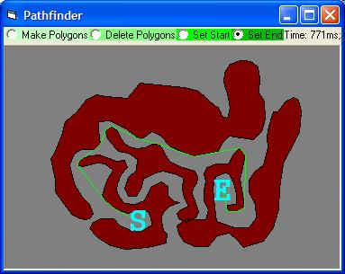

<div align="center">

## Accurate Pathfinding


</div>

### Description

It finds the shortest way. Really.
 
### More Info
 


<span>             |<span>
---                |---
**Submitted On**   |2004-02-25 06:26:54
**By**             |[amoxys](https://github.com/Planet-Source-Code/PSCIndex/blob/master/ByAuthor/amoxys.md)
**Level**          |Beginner
**User Rating**    |5.0 (65 globes from 13 users)
**Compatibility**  |VB 6\.0
**Category**       |[Data Structures](https://github.com/Planet-Source-Code/PSCIndex/blob/master/ByCategory/data-structures__1-33.md)
**World**          |[Visual Basic](https://github.com/Planet-Source-Code/PSCIndex/blob/master/ByWorld/visual-basic.md)
**Archive File**   |[Accurate\_P175483672004\.zip](https://github.com/Planet-Source-Code/amoxys-accurate-pathfinding__1-54237/archive/master.zip)

### API Declarations

```
GetTickCount Lib "kernel32" () As Long
Polyline Lib "gdi32" (ByVal hdc As Long, lpPoint As POINTAPI, ByVal nCount As Long) As Long
Polygon Lib "gdi32" (ByVal hdc As Long, lpPoint As Any, ByVal nCount As Long) As Long
CreatePolygonRgn Lib "gdi32" (lpPoint As POINTAPI, ByVal nCount As Long, ByVal nPolyFillMode As Long) As Long
PtInRegion Lib "gdi32" (ByVal hRgn As Long, ByVal X As Long, ByVal Y As Long) As Long
DeleteObject Lib "gdi32" (ByVal hObject As Long) As Long
```


